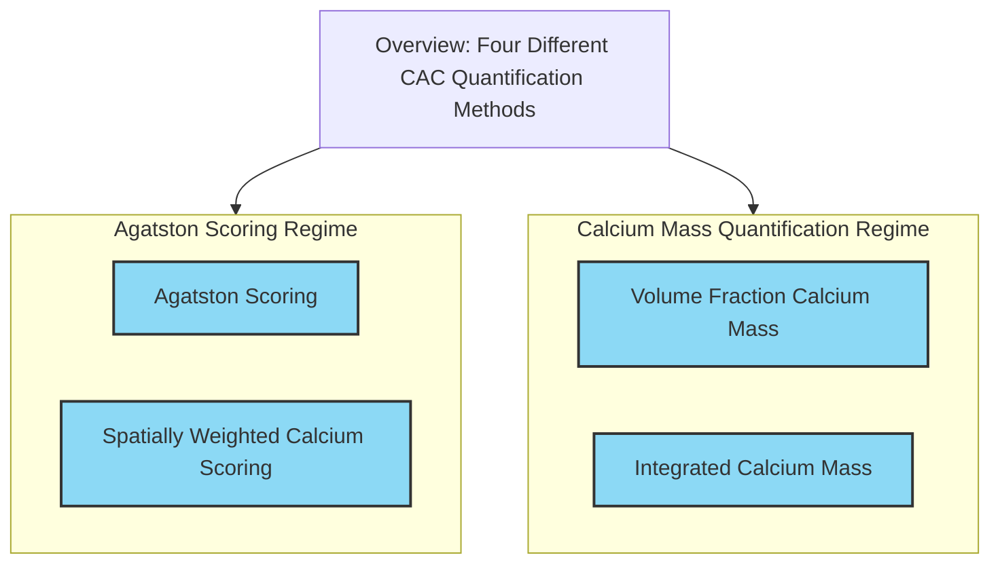
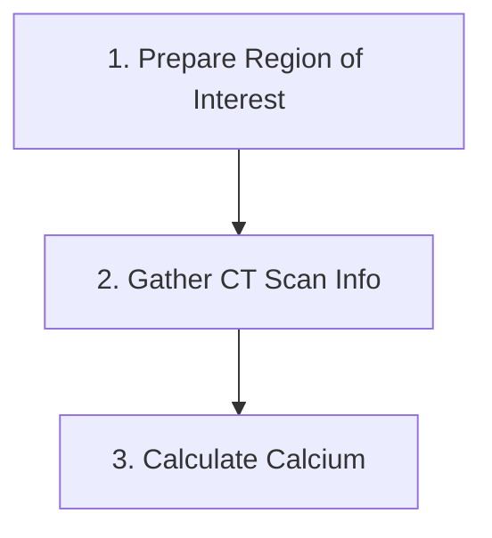

# CalciumScoring

[](https://glassnotebook.io/r/zn0Xr-A1cYegYHSDJzSyO/index.jl)
[](https://github.com/Dale-Black/CalciumScoring.jl/actions/workflows/CI.yml)
[](https://codecov.io/gh/Dale-Black/CalciumScoring.jl)

CalciumScoring.jl is a Julia package for calculating coronary artery calcium scores from CT images using different quantification algorithms. The main function is `score()` which calculates the calcium mass within a CT scan. See the [documentation](https://glassnotebook.io/r/7uus7O8aIcLsGebjQFqxU/docs/(00)%20Getting%20Started.jl) for more details.

## Features

- Handles scan calibration and voxel spacing information
- Accounts for different tube voltages and intensity thresholds
- Easy to use `score()` function

## Installation

```julia
using Pkg
Pkg.add("CalciumScoring")
```

## Usage

The general workflow is:

1. Prepare the region of interest from the CT image
2. Gather scan information like voxel size, spacing, calibration intensity, etc
3. Call `score()` with the ROI, scan info, and desired algorithm


        
For example, calculating the amount of calcium via Agatston scoring looks like:
```julia
# 1
roi = ct_scan .* coronary_artery_mask

# 2
spacing = [1, 1, 1]
mass_cal_factor = density_cal / intensity_cal

# 3
agatston_score, volume_score, mass_score = score(roi, spacing, mass_cal_factor, Agatston())
```

The `score()` function takes the region of interest, voxel spacing, mass calibration factor, and an `Algorithm` specifying which algorithm to use.

### Algorithms
The main algorithms available are:
- `Agatston()`: Traditional Agatston scoring
- `VolumeFraction()`: Volume fraction calcium mass
- `Integrated()`: Integrated calcium mass
- `SpatiallyWeighted()`: Spatially weighted calcium scoring

## References
CalciumScoring.jl implements methods from:
1. [Quantification of coronary artery calcium using ultrafast computed tomography](https://doi.org/10.1016/0735-1097(90)90282-t)
2. [Ultra-low-dose coronary artery calcium scoring using novel scoring thresholds for low tube voltage protocols—a pilot study ](https://doi.org/10.1093/ehjci/jey019)
3. [Coronary artery calcium mass measurement based on integrated intensity and volume fraction techniques](https://doi.org/10.1117/1.JMI.10.4.043502)
4. [Integrated intensity-based technique for coronary artery calcium mass measurement: A phantom study](https://doi.org/10.1002/mp.16326)
5. [An alternative method for quantifying coronary artery calcification: the multi-ethnic study of atherosclerosis (MESA)](https://doi.org/10.1186/1471-2342-12-14)
6. [Spatially Weighted Coronary Artery Calcium Score and Coronary Heart Disease Events in the Multi-Ethnic Study of Atherosclerosis](https://doi.org/10.1161/CIRCIMAGING.120.011981)
